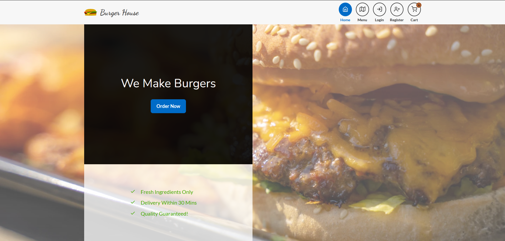
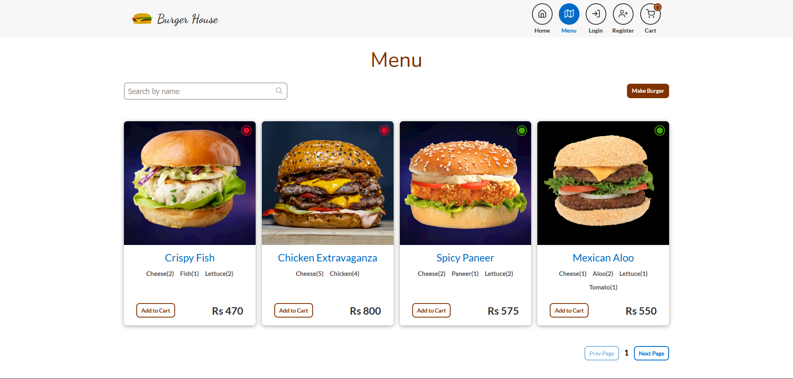
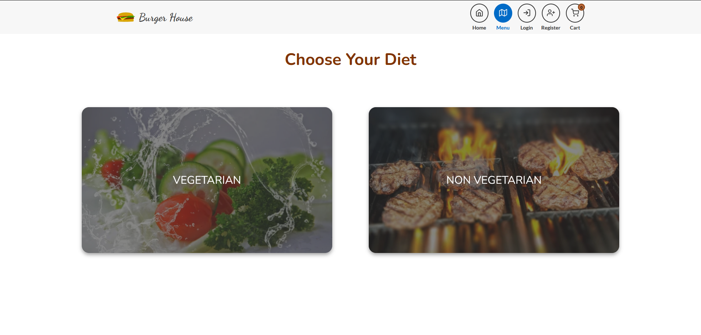
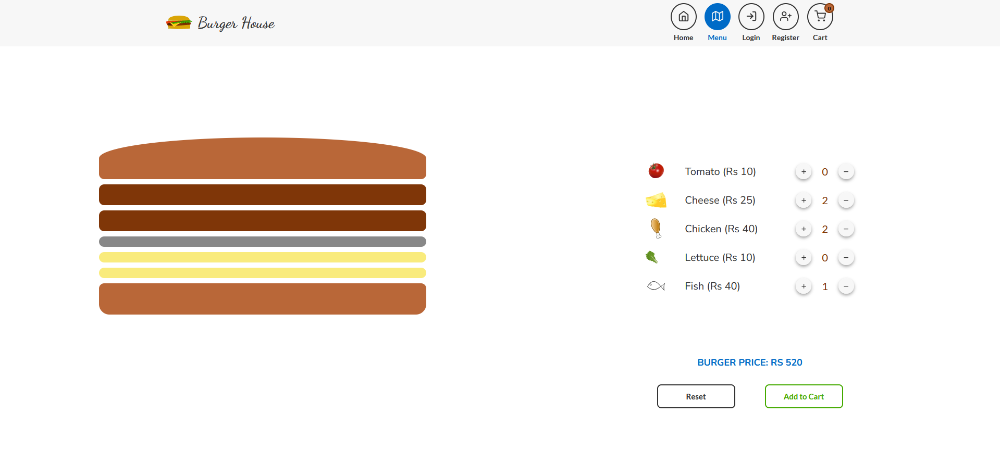
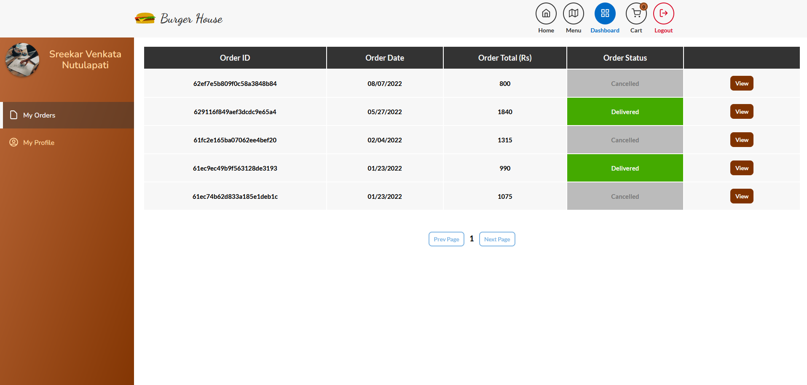
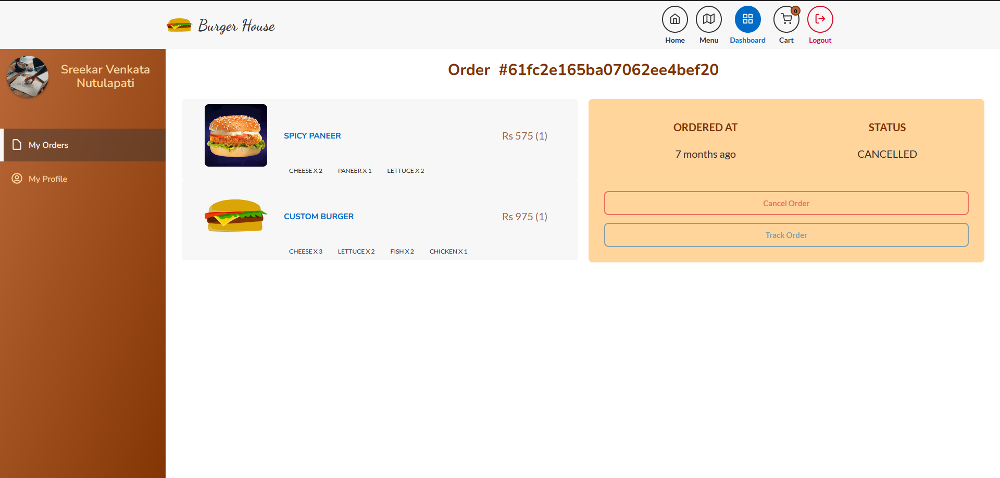
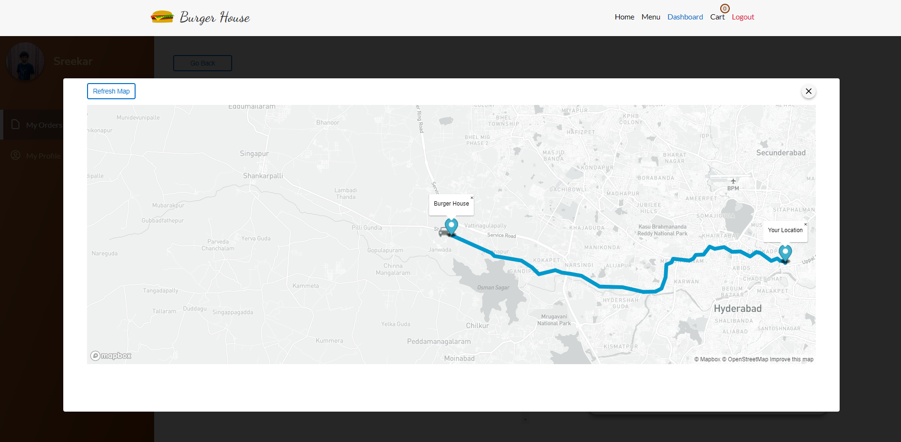
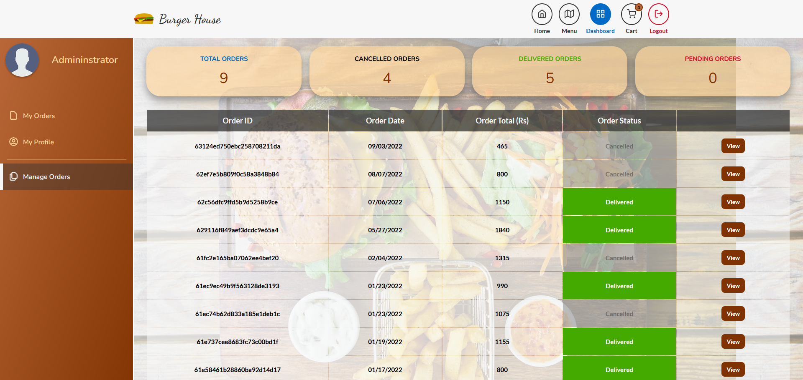
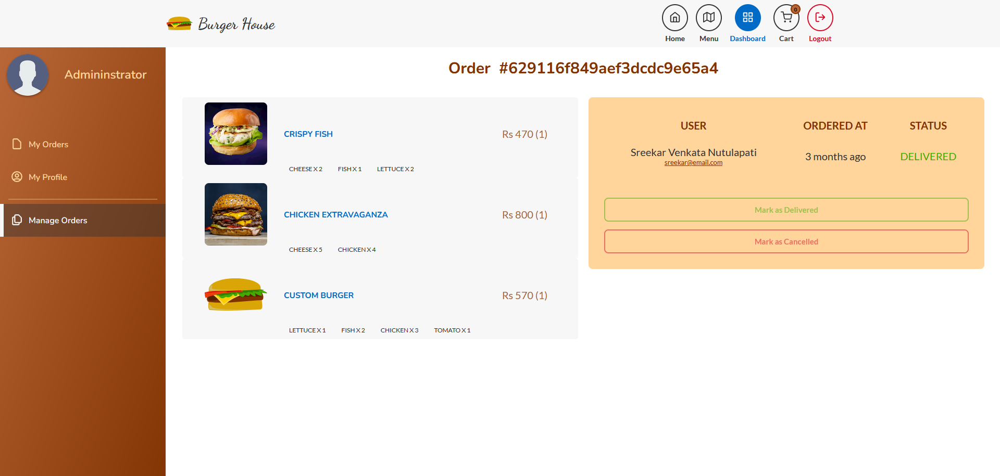

# Burger House: Fast Food Ecommerce Website

Burger house is a fast-food e-commerce site similar to mcdonalds or burger king which sells burgers. This website allows you to choose burgers from a menu or you are free to make your own burger with the given ingredients. To place an order you must be logged in.

live-preview: https://burger-house-sreekar.netlify.app/

# Getting Started

### Make sure you have installed Node JS and yarn

Running dev server

        yarn install 
        yarn dev

Building the app

        yarn build

# Home Page

# Menu Page

# Make your own burger !

In case you don't like the menu you can make your own burger.

# Customer Dashboard

Customers (admins also) can update their details, view their order status, cancel the order and track location of mock delivery.

# Admin Dashboard

Admins can update existing manage orders

# Techonlogies Used

1. [Next](https://nextjs.org/)
2. [tRPC](https://trpc.io/) + [Tanstack Query](https://tanstack.com/query/v4/docs/react/overview)
4. [Framer Motion](https://www.framer.com/motion/)
5. [Redux Toolkit](https://redux-toolkit.js.org/)
6. [MongoDB](https://mongodb.com/)
7. [MapBox](https://www.mapbox.com/)
8. [Sass](https://sass-lang.com/)

# Credentials

    Admin:  email: admin@email.com
            Pass: Pass123#

    user : email: user1@email.com (You can create your own account)
            Pass: Pass123#
