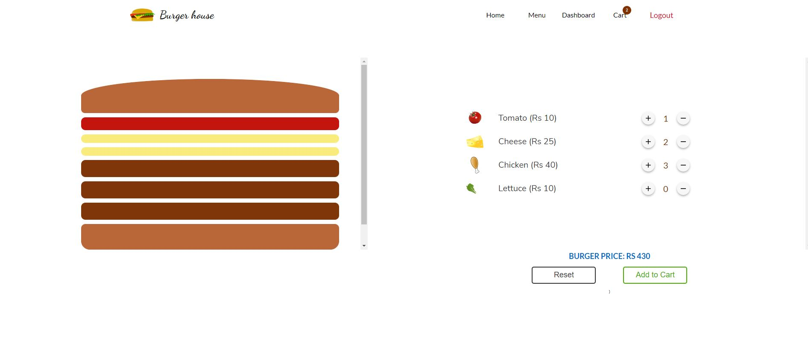
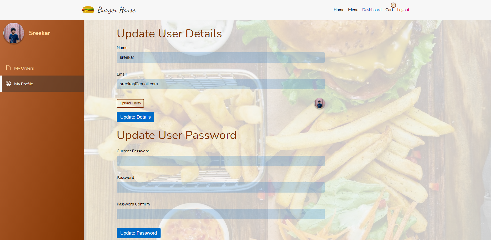
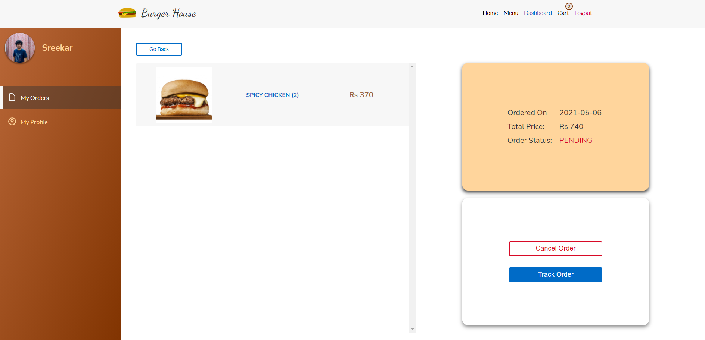
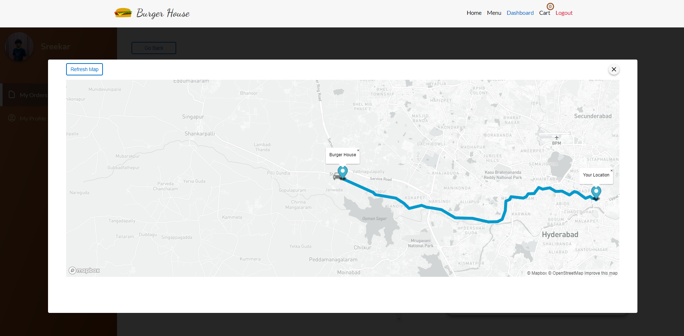
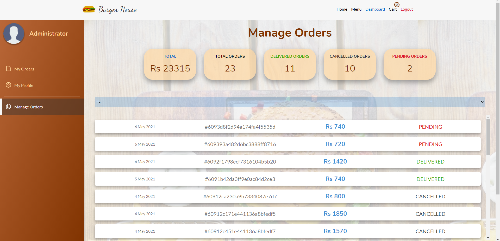
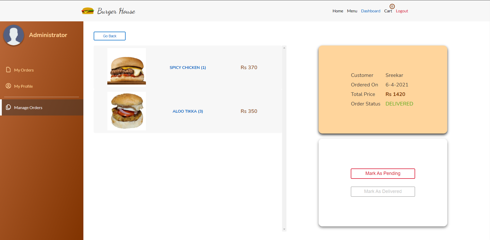

# Burger House: Fast Food Ecommerce Website

Burger house is a fast-food e-commerce site similar to mcdonalds or burger king which sells burgers. This website allows you to choose burgers from a menu or you are free to make your own burger with the given ingredients. To place an order you must be logged in.

live-preview: https://burger-house-sreekar.netlify.app/

# Home Page

# Menu Page

# Make your own burger !

In case you don't like the menu you can make your own burger.

# Customer Dashboard

Customers (admins also) can update their details, view their order status, cancel the order and track location of mock delivery.

# Admin Dashboard

Admins can update existing manage orders

# Techonlogies Used

    1. Reactjs
    2. Expressjs
    3. MongoDB
    4. MapBox

# credentials

    Admin:  email: admin@email.com
            Pass: Pass123#

    user : email: user1@email.com (You can create your own account)
            Pass: Pass123#
