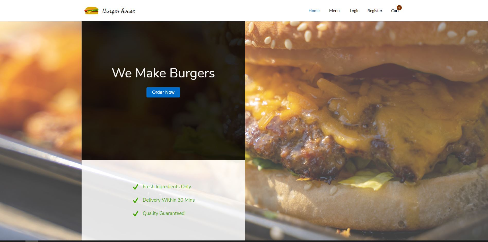
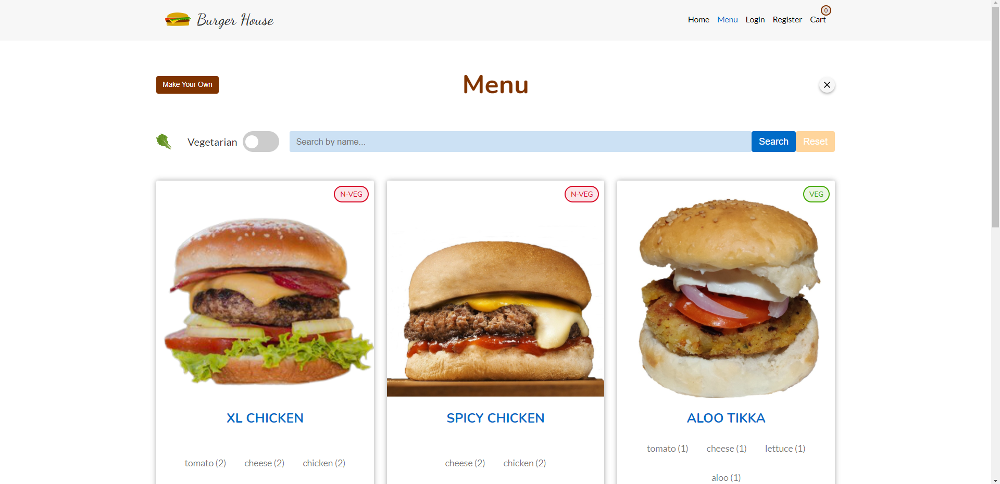
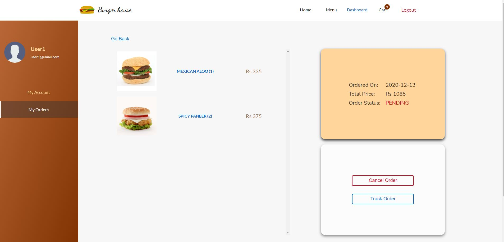
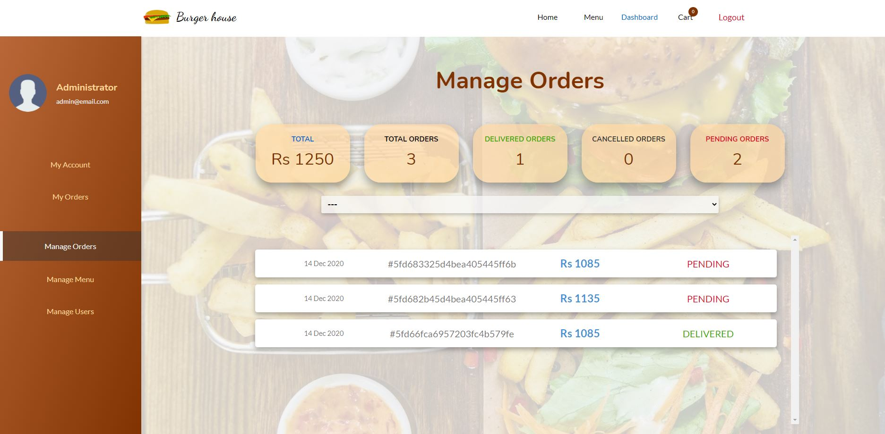

# Burger House: Fast Food Ecommerce Website

Burger house is a fast-food e-commerce site similar to mcdonalds or burger king which sells burgers. This website allows you to choose burgers from a menu or you are free to make your own burger with the given ingredients. To place an order you must be logged in.

# Home Page

# Menu Page

# Make your own burger !
In case you don't like the menu you can make your own burger.

# Customer Dashboard
Customers (admins also) can update their details, view their order status, cancel the order and track location of mock delivery.

# Admin Dashboard
Admins can update existing burgers, manage orders and users

# Techonlogies Used
This website was built using ReactJs for the frontend and ExpressJs and mongoDB for the backend

# credentials 
    Admin:  email: admin@email.com
            Pass: Pass123#

    user : email: user1@email.com (You can create your own account)
            Pass: Pass123#

